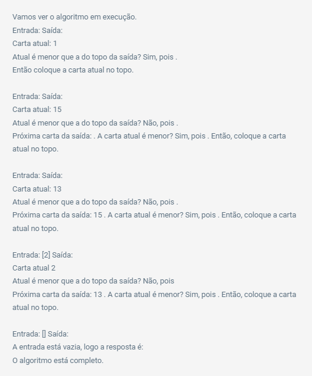
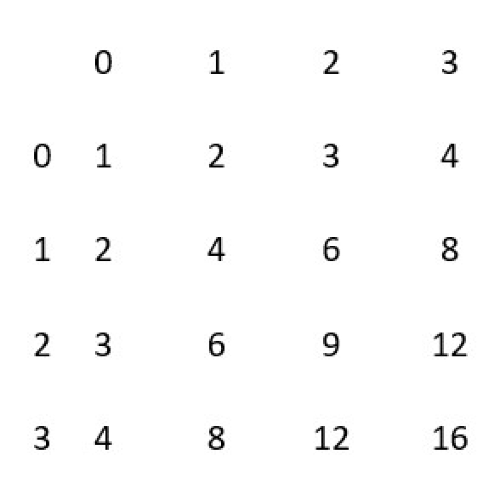

Algorithms and the Python Language:

# ****Algoritmos e a Linguagem Python****

# ****Recursão e complexidade de algoritmos****

## **Conceito de algoritmo e procedimentos**

Atualmente, os computadores estão presentes em nosso dia a dia, criando diversas facilidades e resolvendo vários problemas. Como um computador pode ser tão versátil a ponto de nos permitir resolver contas, falar com amigos, jogar e realizar outras atividades?

O conceito matemático por trás da versatilidade dos computadores é o de algoritmo, cuja origem remonta à era clássica, mas que ganhou muita força no século XIX, com a sua adoção nos programas de computador. Mas o que é um algoritmo?

O algoritmo é uma sequência finita de passos bem definidos para solucionar determinado problema.

Analisando a definição, você pode observar algumas características:

1. O algoritmo deve ser finito, ou seja, ele eventualmente deve parar de executar e chegar à conclusão se solucionou ou não o problema que deveria resolver.

2. O algoritmo deve ter passos bem definidos, ou seja, não pode haver dúvidas sobre o que deve ser feito a cada passo executado.

3. O algoritmo deve estar associado à resolução de um problema.

Muitas vezes, o programa de computador se utilizará de um ou mais algoritmos na sua execução. Além disso, os programas associam esses algoritmos a algum tratamento de dados de entrada, isto é, cada execução será diferente, pois os dados iniciais que servem de entrada para o algoritmo mudam também em cada uma delas.

Vejamos exemplos para tornar esse conceito mais compreensível.

# Exemplo: algoritmo simples

Vamos analisar o problema de ordenação. Para começar, você tem que entender o problema.

Matematicamente, o problema de ordenação recebe como entrada uma sequência de números naturais distintos em qualquer ordem e como saída deve entregar a mesma sequência de números, porém ordenada em ordem crescente.

Esse mero construto matemático, entretanto, pode ser reescrito para resolver problemas mais próximos da realidade. Vamos imaginar um baralho de cartas de jogo, com 52 cartas, no qual você escreve os números naturais. Depois você pode separar um subconjunto dessas cartas e embaralhá-las. Essa seria a entrada do problema. A saída será você terminar com o mesmo baralho com as cartas sobrepostas em ordem crescente.

Confira um algoritmo simples para resolver esse problema é:

1. Pegue a carta do topo do baralho de entrada (carta atual).

2. Compare a carta atual com a carta do topo do baralho de saída: **se** a da saída for maior, **então** coloque a carta atual no topo do baralho de saída, **senão** repita o passo 2 com a próxima carta do baralho de saída.

3. **Se** o baralho de entrada estiver vazio, **então** o algoritmo acabou, **senão** repita o passo 1.

Você acha que com esses três passos você consegue ordenar o baralho? Isso é um algoritmo?

## **Comentário**

Analisando, podemos ver que algoritmo é um conjunto finito de passos, e ele terminará quando o baralho de entrada acabar, ou seja, todas as cartas tiverem sido ordenadas. Entretanto, o “algoritmo” não está bem definido. O que acontece quando pegamos a primeira carta do baralho de entrada e o baralho de saída está vazio? Perceba que não explicamos o que acontece nesse caso. Como você pode resolver esse problema?

Existe mais de uma maneira de resolver o problema, e essa diferença mostra um pouco como a criatividade na hora de criar um algoritmo é importante. O jeito mais simples é criar mais uma cláusula de condição (**se... então**) substituindo o segundo passo:

**Se** o baralho de saída estiver vazio, **então** coloque a carta atual no topo do baralho de saída; **se não** , compare a carta atual com a carta do topo do baralho de saída. **Se** a da saída for maior, **então** coloque a carta atual no topo do baralho de saída; **se não** , repita o passo 2 com a próxima carta do baralho de saída.

## **Atenção!**

Outro jeito envolve criar uma abstração, uma carta “virtual” de valor infinito que começa presente no baralho de saída. Quando o algoritmo termina, você entrega a saída sem essa carta de valor infinito. Você consegue ver como essa abstração resolve o problema sem alterar o algoritmo original?



# Procedimentos e funções

Embora o conceito de algoritmo seja matemático, você provavelmente vai trabalhar com os construtos que utilizam os algoritmos, os programas de computador. Para facilitar o entendimento do programa (ou dos algoritmos), os programadores costumam organizar pedaços do código que são repetidos várias vezes em um procedimento ou função.

**Um procedimento é um conjunto de comandos organizado sob um “nome” que costumamos denominar de chamada de procedimento. Geralmente, fica em outra parte do código do programa, facilitando a compreensão geral do programa e podendo ser chamado em diversas ocasiões distintas pelo programa.**

Já a **função** é um tipo de procedimento que, ao seu término, retorna algum valor para o programa que o chamou, o que denominamos “retorno da função”.

# Continuação do exemplo: procedimentos e funções

Considere que temos um novo programa que executa a ordenação que vimos no exemplo anterior diversas vezes em sequência. Como ele se pareceria?

1. **Embaralhe** as cartas.

2. **Ordene** as cartas.

3. **Repita** a partir do passo 1.

Esse simples programa fica embaralhando e ordenando as cartas repetidamente. Mas o que significa a frase “Ordene as cartas”? Podemos entender essa linha como uma chamada ao procedimento de ordenar as cartas, que descrevemos no exemplo anterior.

Desse modo, o programa principal fica mais simples de entender, e você pode se deparar com outro programa que precise embaralhar as cartas. Nesse caso, você também já tem o procedimento que realiza essa tarefa pronta, bastando chamá-lo novamente.

Como exemplo de função, você pode criar um procedimento que devolve como saída o menor número que está na sequência. Lembre-se de que uma função é um tipo especial de procedimento que retorna um valor como sua saída.

Você consegue escrever tal função? Como ela se parece se for executada sobre um baralho ordenado? E como ela se parece quando executada em um baralho desordenado?

Caso o baralho esteja ordenado, em ordem crescente, a função é muito simples, retorne a carta do topo do baralho. No caso desordenado, precisaremos percorrer todo o baralho, guardando qual foi o menor número visto nesse percurso. Esse número é a saída da função. Veja o exemplo:

1. Comece com o menor valor valendo infinito.

2. **Se** o baralho acabou, **então** retorne o menor valor.

3. Compare o menor valor com a carta do topo:**se** a carta for menor, **então** atualize o menor valor com o valor da carta.

4. Passe para a próxima carta e **repita** a partir do passo 2.

A diferença entre as duas formas de criar a função leva à nossa próxima discussão. Qual desses jeitos é melhor? Como podemos medir e comparar dois algoritmos, procedimentos ou funções distintas que resolvem o mesmo problema?

## **Complexidade de algoritmos**

### Conceito de complexidade de algoritmo

Como podemos medir a qualidade de um algoritmo para solucionar um problema? O jeito empírico é executar o algoritmo e medir o tempo que o computador demora para terminar. Mas essa medida pode variar com diversos elementos externos e independentes do algoritmo em si.

Para comparar teoricamente e de forma aproximada o tempo de execução de um algoritmo, e de certa forma sua qualidade, criou-se o conceito de complexidade de algoritmo.

**Complexidade de algoritmo é uma aproximação do tempo de execução do algoritmo, calculado segundo algumas simplificações para permitir comparar a qualidade de algoritmos independentemente do equipamento sobre o qual ele está executando.**

A primeira premissa usada é a de calcular a complexidade em relação ao tamanho da entrada do programa/algoritmo. No nosso problema de ordenação, a complexidade será expressa em relação ao número de elementos na sequência a ser ordenada. Na simplificação com baralhos, a complexidade será expressa em relação ao número de cartas do baralho de entrada.

Mas o que vamos comparar? No nosso algoritmo de ordenação, cada comparação pode ser considerada de custo de tempo . Vamos calcular três tipos diferentes de complexidade para nosso exemplo.

- Complexidade de melhor caso
    
    A complexidade de melhor caso é o tempo aproximado de execução do algoritmo quando a entrada é a melhor possível para o algoritmo.
    
    No nosso exemplo da ordenação, imagine qual caso seria o melhor possível. Qual baralho de entrada é o mais positivo para o algoritmo?
    
    Estranhamente, o melhor caso para o nosso algoritmo de ordenação é o baralho de entrada estar ordenado exatamente na ordem decrescente.
    
    Imagine que o baralho de entrada tem cartas. Assim, a primeira carta será comparada com o baralho de saída vazia, levando tempo . A próxima carta será comparada com a do topo e será menor, logo será ali colocada, levando tempo . Isso se repetirá para cada carta, levando um total de (repetido vezes), isto é, nT. A essa complexidade chamamos de linear, pois depende do tamanho de entrada , de uma forma linear (o expoente de é 1).
    
    A complexidade de melhor caso raramente é usada como parâmetro para comparação de algoritmos, principalmente porque o melhor caso por diversas vezes é de solução trivial.
    
- Complexidade de caso médio
    
    A complexidade de caso médio é o tempo aproximado de execução do algoritmo quando a entrada apresenta um comportamento próximo da média dificuldade. Esse tipo de cálculo envolve o uso de certas técnicas estatísticas, principalmente o conceito de valor esperado, também chamado de esperança ou média.
    
    No nosso exemplo da ordenação, a cada carta avaliada do baralho de entrada, quantas comparações precisarão ser feitas?
    
    Na primeira carta, haverá apenas uma comparação, pois o baralho de saída está vazio  (tempo ).
    
    A partir da segunda carta, existe uma chance de precisar de uma comparação e uma chance de precisar de duas comparações. Assumindo que as chances são iguais, a esperança é de que precisaremos de 1,5 comparações, ou seja, em média tempo .
    
    Isso pode ser repetido para as próximas cartas, gerando tempos esperados de , e assim por diante, até .
    
    O tempo total do caso médio então será representado pela soma . Calculando chegamos a:
    A complexidade de caso médio é usada eventualmente, mas não é a mais comum por depender de avaliações estatísticas que às vezes dificultam seu cálculo.
    
- Complexidade de pior caso
    
    A complexidade de pior caso é o tempo aproximado de execução do algoritmo quando a entrada é a pior possível para este.
    
    No nosso exemplo da ordenação, imagine qual caso seria o pior possível. Qual baralho de entrada é o mais negativo para o algoritmo?
    
    Você consegue calcular o tempo de execução nesse caso, com uma entrada de cartas já ordenadas?
    
    A primeira carta será colocada no topo, custando 1 comparação (tempo ). A segunda será comparada com a primeira, será maior, depois será comparada com o baralho vazio e colocada ali (tempo ). Seguirá assim por diante, até que a última carta seja comparada com todas as outras, o que leva tempo . O tempo total será de . Calculando chegamos a: .
    
    Essa complexidade chamamos de quadrática, pois o termo dominante é .
    
    A complexidade de pior caso é a mais comumente usada na comparação de algoritmos.
    
- Complexidade assintótica
    
    Quando falamos de complexidade de algoritmos, normalmente queremos analisar a dificuldade de resolver problemas com entradas grandes. Dessa forma, você pode prever o comportamento conforme o tamanho da entrada aumenta de forma arbitrária.
    
    A diferença entre um bom algoritmo linear e um algoritmo quadrático pode ser pequena para uma entrada de tamanho pequeno (5, por exemplo), mas é excepcionalmente grande para uma entrada de tamanho 1.000.
    
    Para ilustrar a diferença, pode-se analisar o gráfico a seguir, de uma função linear e uma quadrática .
    
    
    
    Como você pode perceber, eventualmente há um tamanho de entrada em que a função quadrática é sempre maior que a linear, e isso vale para qualquer constante multiplicativa finita do fator linear.
    
    Por isso, na complexidade de algoritmos, costumamos analisar o comportamento assintótico, ou seja, o comportamento a partir de um tamanho de entrada arbitrariamente grande, após o qual o comportamento das funções fica estabilizado.
    
    No cálculo de complexidade assintótica, usamos uma aproximação, em que se descartam multiplicadores do tamanho da entrada e elementos constantes ao final do cálculo.
    
    Por exemplo, uma complexidade calculada de será aproximada por . Você pode dizer que o termo é dominante na complexidade, pois os outros termos serão muito menores que quando é grande o bastante.
    

# Notação O

Do conceito de complexidade assintótica de algoritmo surge a notação para permitir a fácil comparação entre complexidades. A notação O serve para comparar assintoticamente duas funções.

Dizemos que uma função é quando a partir de um determinado arbitrariamente grande e uma constante . Traduzindo, se é , então a função é "maior" que para um valor suficientemente grande de (às vezes, é necessário multiplicar por uma constante finita ).

Você consegue ver como podemos utilizar isso na complexidade de algoritmos? A complexidade de um algoritmo de pior caso pode ser diretamente expressa com a notação . Por exemplo, dizemos que um algoritmo é quando sua complexidade de pior caso é linear.

No exemplo de ordenação, nosso algoritmo de ordenação é , pois sua complexidade de pior caso é dominada pelo termo quadrático .

## **Recursão**

Alguns tipos de problema podem ser resolvidos de forma mais fácil utilizando recursão, mas o que exatamente é isso?

Uma função recursiva é aquela que chama a si mesma dentro do seu código, com outros parâmetros de entrada.

Para utilizar recursão, você precisa tomar cuidado para não chamar a si mesmo infinitamente. Por isso, toda função recursiva deve ter um caso base, no qual ela retorna uma saída sem chamar a si mesma para alguma entrada.

Veja a seguir dois exemplos de problemas que podem ser resolvidos usando recursão.

# Aplicando recursão – fatorial

No primeiro exemplo, você deve calcular o fatorial de um número , ou seja, !

Você pode calcular fatorial de multiplicando ! e assim por diante, até chegar a que é o nosso caso base, retornando o valor 1.

Ao escrever isso como uma função, você terá:

1. **se** n=1, **então** retorne 1.

2. **retorne** n*fatorial(n-1) }.

Perceba que no passo 2 a função chama a si mesma. A chamada da função fatorial(4), por exemplo, fará chamada a fatorial(3), que chamará fatorial(2) e que chamará fatorial(1), que por sua vez começará a retornar valores que serão multiplicados até o cálculo da chamada original.

Você consegue calcular a complexidade de pior caso dessa função?

A chamada básica retorna um número, e a chamada recursiva executa uma multiplicação de dois números.

Se você assumir que a multiplicação leva um tempo fixo, basta calcular o número de chamadas recursivas feitas.

Para uma entrada , são chamados fatorial de até fatorial de 1. Há um total de chamadas e multiplicações, logo a complexidade é de 1) , ou seja, o cálculo é , ou linear.

# Aplicando recursão – sequência de Fibonacci

No segundo exemplo, você deve calcular o valor do n-ésimo termo da sequência de Fibonacci. Essa sequência é [1,1,2,3,5,8,13,21,...], na qual cada elemento da sequência é igual à soma dos dois anteriores.

Como a própria definição da sequência é recursiva, fica fácil escrevê-la como uma

função recursiva:

função fibonacci(n){

1. **se** n=1 ou n=2, **então** retorne 1

2. **retorne** fibonacci(n-1)+ fibonacci(n-2)}

Perceba que no passo 2 a função chama a si mesma duas vezes. A chamada da função fibonacci(4), por exemplo, fará chamada a fibonacci(3) e fibonacci(2). Já fibonacci(3) chamará fibonacci(2) e fibonacci(1).

Você consegue calcular a complexidade de pior caso dessa função? Cada passo 2 envolve a soma de dois números, que consideramos levar tempo . Então, basta calcular o número de chamadas de fibonacci(n) .

Para facilitar o cálculo, podemos assumir que a linha 1 da função também leva tempo , que alterará muito pouco no cálculo final, assim basta calcularmos o número de chamadas da função como um todo.

Para fibonacci(4) há 4 chamadas, para fibonacci(5) há 8 chamadas, para fibonacci(6) há 12 chamadas, e assim por diante. Essa sequência cresce exponencialmente, motivo pelo qual dizemos que essa função é ou, ainda, que tem complexidade exponencial.

A complexidade exponencial torna um algoritmo impraticável de executar para tamanhos crescentes de forma acelerada. , já seriam necessárias milhões de operações; com , o tempo de execução já estaria na casa de alguns anos.

Esse é um exemplo de que o uso de recursão nem sempre é a opção correta. O valor de um termo da sequência de Fibonacci pode ser calculado diretamente por meio de uma fórmula simples.

---

---

# **Arrays em Python**

## **Arrays**

### **Vetores ou arrays**

Em um programa, normalmente, você precisa manipular dados durante sua execução. Assim, usamos variáveis para representar um espaço na memória no qual um dado pode ser armazenado e acessado.

Mas o que fazemos quando a quantidade de dados começa a crescer? Será que precisamos gerar uma variável para cada dado? Os vetores, ou arrays, servem para resolver esse problema.

Um array é um tipo especial de variável capaz de agregar um conjunto de valores em um espaço contíguo de memória. Se você possuir uma lista de elementos, pode salvá-los todos em um array e acessá-los diretamente.

Por exemplo, se você possuir uma lista de números [257,42,28730] e organizá-los em um array chamado **Lista Final**, essa variável ficará disposta na memória de forma contígua.

Exemplo de disposição do array:

| Deslocamento | Endereço de memória | Valor |
| --- | --- | --- |
| 2 | OxFF750164 | 28730 |
| 1 | OxFF750162 | 42 |
| 0 | OxFF750160 | 257 |

O endereço real de memória ali colocado não pode ser previsto, mas o importante é que, conhecendo o primeiro endereço — que será salvo na variável do array —, você consegue acessar qualquer elemento do array. Vejamos como isso funciona!

# Elementos de um array

Um array tem dois elementos principais:

1. Seu nome, pelo qual nos referimos à variável e essencialmente guarda o valor do endereço de memória base do array.

2. Seus componentes, representados pelo seu valor e pelo seu deslocamento (também chamado índice). O deslocamento começa sua contagem em 0 e é incrementado em 1 unidade a cada novo valor adicionado.

No nosso exemplo anterior, você teria Lista_Final[0] valendo 257, Lista_Final[1] valendo 42 e Lista_Final[2] valendo 28730.

Lembre-se de que os índices são contados a partir do 0, pois representam seu deslocamento em relação ao endereço base da memória.

# Tamanho do array

Se o array é uma variável especial que pode guardar diversos valores, como sabemos que tamanho ocupará? Para isso, precisamos saber a quantidade de índices que o array terá e qual tipo de variável será salvo em cada índice. Multiplicando o tamanho da variável salva pelo número de índices, você terá o tamanho do array.

Por exemplo, um array de inteiros (cada um ocupando 2 bytes) com 10 índices precisará de 20 bytes de memória separado para seu uso.

# Endereço relativo e endereço real

E como acessamos o terceiro elemento do array? Ao escrevermos vetor[2], o endereço base de vetor será acessado (por exemplo endereço de memória 16), depois será multiplicado o deslocamento (2) pelo tamanho de cada componente do array (2 bytes), e isso será somado ao endereço base. Com isso, o endereço real de vetor[2] será 20. Você pode ver um exemplo do vetor na tabela a seguir!

Exemplo de endereço do array

| Deslocamento | Endereço de memória | Valor |
| --- | --- | --- |
| 4 | 24 | 32 |
| 3 | 22 | 54 |
| 2 | 20 | 28730 |
| 1 | 18 | 42 |
| 0 | 16 | 257 |

## **Usando arrays em Python**

### **Usando listas como array**

Agora que você já entendeu o que é e para que serve um array, vamos usá-lo de forma prática na linguagem Python.

Python não tem arrays de forma nativa, mas você pode utilizar o elemento **list** para substituí-las de forma muito simples.

Para declarar um vetor com três nomes João, Maria e Ana, basta você usar:

```python
nomes = [“João”, “Maria”, “Ana”]
```

# Acessando um elemento

Para acessar um elemento diretamente, basta você escrever o nome da variável e o índice do elemento. Por exemplo:

```python
nomes = ['João', 'Maria', 'Ana']
x =nomes[2]
print(x)

# Ana
```

O resultado será “Ana”, pois é o terceiro valor da lista. Aqui cabe um aviso: ao usar listas, se você tentar acessar um índice fora dos existentes na lista, seu programa causará um erro, pois você estaria tentando acessar um espaço de memória que não está alocado para aquela variável.

# Descobrindo o tamanho da lista

Se você quiser saber o tamanho de uma lista em Python, pode usar o comando **len()**( que vem de *length*, ou comprimento em inglês). Veja o código a seguir:

```python
nomes = ['João', 'Maria', 'Ana']
x =len(nomes)
print(x)

# 3
```

Esse código mostra como você pode acessar o tamanho de uma lista, no caso x terá o valor de 3, pois a lista tem 3 elementos.

# Iterando sobre a lista

Outra necessidade comum em um array é a de percorrê-lo elemento por elemento. Em Python, você pode iterar sobre a lista (percorrer elemento por elemento) com o código a seguir:

```python
nomes = ['João', 'Maria', 'Ana']
for x in nomes:
    print(x)

# João
# Maria
# Ana
```

# Alterando a lista

Como você pode manipular uma lista depois de criá-la? Que tipo de operações você pode querer fazer? As operações mais simples que podem ser feitas em qualquer estrutura de dados, incluindo listas, são a adição de um elemento e a remoção de um elemento.

# Adicionando um elemento

Em Python, para adicionar um elemento a uma lista já existente, basta você usar o comando **append()**.

```python
nomes = ['João', 'Maria', 'Ana']
print(nomes)
nomes.append('José')
print(nomes)

# ['João', 'Maria', 'Ana']
# ['João', 'Maria', 'Ana', 'José']
```

# Removendo um elemento

Em Python, para remover um elemento conhecido de uma lista já existente, você pode usar o comando **remove()**

```python
nomes = ['João', 'Maria', 'Ana']
print(nomes)
nomes.remove('João')
print(nomes)

# ['João', 'Maria', 'Ana']
# ['Maria', 'Ana']
```

Você pode verificar que o elemento que tinha valor “João” foi removido da lista.

Se, ao invés de remover um item por seu valor, você quiser remover pelo índice, poderá usar o comando **pop()**

```python
nomes = ['João', 'Maria', 'Ana']
print(nomes)
nomes.pop(1)
print(nomes)

# ['João', 'Maria', 'Ana']
# ['João', 'Ana']
```

O valor de “Maria” foi removido pois estava no índice 1.

# Usando arrays diretamente

Para usar arrays em Python de forma direta, você precisa importar a biblioteca **numpy** e utilizar o elemento array.

# Criando um array

Para criar arrays com numpy, use:

```python
import numpy as np
arr = np.array([1, 2, 3, 4, 5])
print(arr)

# [1 2 3 4 5]
```

Nesse código, criamos um array contando os elementos de 1 a 5.

# Acessando um elemento

Para acessar um elemento da array, use o índice entre colchetes:

```python
import numpy as np
arr = np.array([1, 2, 3, 4, 5])
print(arr[0])

# 1
```

Você pode também acessar os elementos contando de trás para frente, usando índices negativos. Por exemplo, arr[-1] terá o valor de 5. Experimente.

# Tipo de dado armazenado

Quando um array é criado, ele contém valores de determinado tipo. Se você criar um array com números inteiros, ele será de tipo inteiro. Da mesma forma, se você criar com strings, ele será automaticamente criado com strings. Você pode verificar o tipo de array com o comando **arr.dtype**:

```python
import numpy as np
arr = np.array([1, 2, 3, 4, 5])
print(arr.dtype)

# int64
```

Quando você cria o array, pode assinalar um tipo específico usando o comando dtype.

```python
import numpy as np
arr = np.array([1, 2, 3, 4, 5], dtype='S')
print(arr.dtype)

# |S1
```

Nesse exemplo, criamos um array contendo strings.

# Usando copy e view

Ao usar o comando copy, você cria uma cópia do array. Qualquer alteração feita na cópia não afetará o valor do array original. Veja o código a seguir:

```python
import numpy as np
arr = np.array([1, 2, 3, 4])
x=arr.copy()
x[0]=42
print(arr)
print(x)

# [1 2 3 4]
# [42  2  3  4]
```

Quando você usa o comando view, está usando outra variável para se referenciar ao mesmo array. Qualquer alteração feita em uma variável alterará o valor do array original.

```python
import numpy as np
arr = np.array([1, 2, 3, 4])
y=arr.view()
y[0]=43
print(arr)
print(y)

# [43  2  3  4]
# [43  2  3  4]
```

# Iterando sobre um array

Quando você precisa percorrer o array, pode usar o laço for para iterar sobre a lista, ou seja, caminhar pela lista elemento a elemento sequencialmente.

```python
import numpy as np
arr = np.array([1, 2, 3, 4])
for x in arr:
    print (x)

# 1
# 2
# 3
# 4
```

Esse código percorre e imprime cada elemento de um array.

Você pode também utilizar a função **enumerate()** se precisar acessar um elemento por meio do seu índice. A função **enumerate(array)** vai criar uma lista duplicada, onde o primeiro elemento contém o índice e o segundo elemento contém o valor guardado no array. Veja o exemplo abaixo:

```python
import numpy as np
arr = np.array([1, 2, 3, 4])
for indice,valor in enumerate(arr):
    print (indice,valor)

# 0 1
# 1 2
# 2 3
# 3 4
```

Esse código imprimirá o valor de cada índice seguido do valor armazenado.

---

---

# **Conjunto de dados multidimensionais**

## **Dados multidimensionais**

Até o momento, você lidou com vetores armazenados em um array (ou em uma lista de Python). Você pode considerar que um vetor tem apenas uma dimensão. Mas o que acontece se você quiser armazenar um vetor de vetores? Como lidar com esse conjunto de dados com várias dimensões?

Se você considerar que um vetor tem uma dimensão, uma matriz pode ser interpretada como um vetor de vetores ou, ainda, como um array de arrays. Assim, quando você acessar o índice do primeiro array, lá, no seu elemento, estará contido um array inteiro.

Nesse segundo array, você pode realizar todo tipo de interação que pode ser feito em um array unidimensional, como remover ou adicionar elementos, iterar ou descobrir o tamanho, entre outros.

Esse pensamento pode ser propagado por quantas dimensões você desejar, aninhando arrays dentro de arrays. A seguir, temos o exemplo de uma matriz:



Nessa matriz, o primeiro elemento matriz[0] é o vetor(1,2,3,4). O segundo elemento matriz[1] é o vetor (2,4,6,8), e assim por diante.

Caso você queira acessar o segundo elemento do terceiro vetor, deve escrever matriz[2][1], que corresponde ao elemento de valor 6.

## **Matrizes em Python**

O uso de dados multidimensionais em Python pode ser feito, assim como no caso unidimensional, por meio do uso de listas ou de arrays com a biblioteca numpy.

O jeito mais simples de tratar dados multidimensionais em Python é utilizando listas. Elas são uma abstração fundamental da linguagem Python e podem ser aninhadas diversas vezes, ou seja, você pode fazer listas de listas e assim por diante. Além disso, as listas em Python estão preparadas para ter tipos de dados distintos, o que permite ter um elemento da lista que é uma lista e outro apenas um número ou uma palavra (“String”).

# Declarando matrizes como listas

Para declarar uma matriz como lista, você deve usar a declaração unidimensional repetidas vezes. Veja o exemplo no código a seguir:

```python
amigos =[[“João”,25,“Câncer”], [“Maria”,23,“Áries”], [“Ana”,31,“Aquário”]]
print(amigos)
```

Essa matriz guarda os amigos em uma lista, na qual cada amigo tem seu nome, idade e signo anotados. Repare que há um par de colchetes mais externo que contém todas as listas, e cada lista interna está separada pelo seu próprio par de colchetes. Os elementos de cada lista são separados por vírgulas.

# Inserindo elementos na matriz

Para inserir um elemento na lista de nível mais alto, basta usar o mesmo comando do array unidimensional **append()**:

```python
amigos =[['João',25,'Câncer'], ['Maria',23,'Áries'], ['Ana',31,'Aquário']]
amigos.append(['Thiago',30,'Capricórnio'])
print(amigos)

# [['João', 25, 'Câncer'], ['Maria', 23, 'Áries'], ['Ana', 31, 'Aquário'], ['Thiago', 30, 'Capricórnio']]
```

Já para inserir um elemento no segundo nível de lista, você deve usar o colchete com o índice identificando qual elemento da lista de mais alto nível será alterado. Por exemplo, se quiser adicionar a cidade natal de Ana, você deve usar o código a seguir:

```python
amigos[2].append(“Juazeiro”)
```

# Removendo elementos da matriz

Para remover um elemento na lista de nível mais alto, você pode usar a função **remove()** direto na variável da lista. Veja o código a seguir:

```python
amigos =[['João',25,'Câncer'], ['Maria',23,'Áries'], ['Ana',31,'Aquário']]
amigos.remove(['João',25,'Câncer'])
print(amigos)

# [['Maria', 23, 'Áries'], ['Ana', 31, 'Aquário']]
```

Já para remover um elemento de segundo nível da lista, você deve utilizar a variável com o índice selecionado entre colchetes. Veja o código a seguir, que remove a idade de Ana:

```python
amigos =[['João',25,'Câncer'], ['Maria',23,'Áries'], ['Ana',31,'Aquário']]
amigos[2].remove(31)
print(amigos)

# [['João', 25, 'Câncer'], ['Maria', 23, 'Áries'], ['Ana', 'Aquário']]
```

Você pode também remover um elemento por meio do seu índice, ao invés do seu valor, usando o comando pop(). A seguir temos o código que remove o primeiro elemento da lista de mais alto nível e depois remove o segundo elemento do segundo elemento restante. Dessa forma, todo o conteúdo de “João“ será removido, e depois a idade de “Ana”:

```python
amigos =[['João',25,'Câncer'], ['Maria',23,'Áries'], ['Ana',31,'Aquário']]
amigos.pop(0)
amigos[1].pop(1)
print(amigos)

# [['Maria', 23, 'Áries'], ['Ana', 'Aquário']]
```

# Iterando sobre a matriz

A iteração sobre uma matriz é similar ao caso do vetor, mas a cada nível de aninhamento você pode realizar uma nova iteração. Digamos que você queira apenas imprimir a lista linha a linha, com cada linha contendo os dados de cada amigo. Dessa forma, você usa um iterador para o primeiro nível da lista, como visto a seguir:

```python
amigos =[['João',25,'Câncer'], ['Maria',23,'Áries'], ['Ana',31,'Aquário']]
for x in amigos:
    print(x)

# ['João', 25, 'Câncer']
# ['Maria', 23, 'Áries']
# ['Ana', 31, 'Aquário']
```

Agora, para imprimir cada elemento em uma linha, você pode usar dois iteradores aninhados, como a seguir:

```python
amigos =[['João',25, 'Câncer'], ['Maria', 23,'Áries'], ['Ana', 31, 'Aquário']]
for x in amigos:
    for y in x:
	    print(y)

"""
	João
	25
	Câncer
	Maria
	23
	Áries
	Ana
	31
	Aquário
"""
```

Esse código funciona bem no nosso exemplo porque todo elemento de amigos é uma lista, mas as listas podem ter diversos tipos de elementos. O que acontece com esse último código se, na lista amigos, tiver um elemento que contém apenas um nome, como “Mário”?

```python
amigos =[['João',25,'Câncer'], ['Maria',23,'Áries'], ['Ana',31,'Aquário'], ['Mário']]
for x in amigos:
	for y in x:
		print(y)

"""
	João
	25
	Câncer
	Maria
	23
	Áries
	Ana
	31
	Aquário
	Mário
"""
```

Se você testou o código, viu que o elemento “Mário” foi tratado indevidamente como uma lista. Para resolver esse problema, você pode usar a função **isinstance(x,list)** que retorna verdadeiro se x for um objeto do tipo lista.

Nesse caso, o código se parece com o seguinte:

```python
amigos=[['João',25,'Câncer'], ['Maria',23,'Áries'], ['Ana',31,'Aquário'], ['Mário']]
for x in amigos:
	if isinstance (x,list):
		for y in x:
			print(y)
	else:
		print(x)

"""
	João
	25
	Câncer
	Maria
	23
	Áries
	Ana
	31
	Aquário
	Mário
"""
```

Repare que esse código só usa o iterador aninhado se o item de alto nível for uma lista, o que é checado usando-se a função **isinstance()**.

# Matrizes usando arrays

Da mesma forma que no caso unidimensional, você pode preferir utilizar arrays diretamente para representar dados multidimensionais. É importante ressaltar que, diferentemente das listas, o objeto array deve ser homogêneo, ou seja, deve conter elementos de mesmo tipo.

Portanto, você deve ter um array de inteiros ou array de números de ponto flutuante (float). Desse modo, seu array pode ter muitas dimensões, mas cada dimensão será de arrays de mesmo tamanho.

Para ficar mais fácil entender, vamos começar declarando uma matriz usando array da biblioteca numpy.

# Declarando matrizes como arrays

Você pode declarar uma matriz usando o comando np.array da biblioteca numpy, como anteriormente. O importante é saber que cada elemento do array de nível mais alto terá o mesmo tamanho. Veja o código a seguir:

```python
import numpy as np
matriz1=np.array([[1,2],[3,4],[5,6]])
matriz2=np.array([[1,2],[3],[5,6]])
print(matriz1)
print(matriz2)

"""
	[[1 2]
		[3 4]
	 [5 6]]
	[list([1, 2]) list([3]) list([5, 6])]
"""
```

A matriz1 foi corretamente declarada e salva como um array de arrays (uma matriz). Já a matriz2 foi incorretamente declarada, pois o seu segundo elemento tem tamanho 1 ao invés de 2. Assim, ela foi salva como um array de listas. Experimente.

Para acessar determinado elemento da matriz, você pode usar a variável seguida do índice entre colchetes. Por exemplo, matriz1[0] é o vetor (1,2) já matriz1[1][1] é o elemento 4.

# Operações simples com matrizes

Você pode realizar operações simples com matrizes que tenham o mesmo tamanho de forma direta, como soma e subtração. Como exemplo, temos o código a seguir.

```python
import numpy as np
matriz1=np.array([[1,2],[3,4],[5,6]])
matriz2=np.array([[7,8],[9,10],[11,12]])
matriz2=matriz1+matriz2
print(matriz2)
matriz2=matriz2-matriz1
print(matriz2)

"""
	[[ 8 10]
	 [12 14]
	 [16 18]]
	[[ 7  8]
	 [ 9 10]
	 [11 12]]
"""
```

Esse código mostra soma e subtração de matrizes. Você pode usar outras funções simples para cálculo direto na matriz. Como exemplos, há **sum()** que soma todos os elementos da matriz, **max()** que retorna o valor máximo, **min()** que retorna o valor mínimo. As funções **mean()** e **std()** retornam a média e o desvio padrão, respectivamente. A seguir, você verá um código que usa todas essas funções.

```python
import numpy as np
matriz=np.array([[1,2],[3,4],[5,6]])
minimo = matriz.min()
maximo= matriz.max()
soma=matriz.sum()
media=matriz.mean()
desvio=matriz.std()
print("Minimo =", minimo)
print("Maximo =", maximo)
print("Soma =", soma)
print("Media =", media)
print("Desvio =", desvio)

"""
	Minimo = 1
	Maximo = 6
	Soma = 21
	Media = 3.5
	Desvio = 1.707825127659933
"""
```

Assim como no caso unidimensional, no caso multidimensional(matriz) você pode usar a função **enumerate(matriz)** para separar os índices e valores da matriz.

---

---

# **Estudo de caso: o algoritmo de ordenação Bubblesort**

## **O método Bubblesort**

Lembremos o problema de ordenação: dada uma sequência de entrada não ordenada (para facilitar considere números naturais distintos), o problema de ordenação é entregar como saída a mesma sequência, porém em ordem crescente.

Você conhecerá agora uma outra forma de resolver o problema de ordenação, o método Bubblesort ou método da ordenação por bolha. O nome desse algoritmo vem da ideia de flutuar um elemento por vez para o fim da lista, como se fosse um conjunto de bolhas flutuando para o topo de um líquido.

# Bubblesort – o algoritmo

A ideia do método Bubblesort é você iniciar com um array contendo a lista desordenada. Então, o algoritmo vai percorrer o array fazendo trocas par a par entre dois elementos consecutivos, quando estiverem fora da ordem. Ao chegar ao final do array, você recomeça do início, encerrando o algoritmo quando uma das passagens não realizar nenhuma troca (o que significa que o array está ordenado).

Vamos ver isso na prática? Comece com um array não ordenado [10,5,20,1,4].

- Comparar 10 com 5: , logo é preciso trocar. Array atualizado
    
    10>5
    
    [5,10,20,1,4]
    
- Comparar 10 com 20: , não há troca. Array atualizado
    
    10<20
    
    [5,10,20,1,4]
    
- Comparar 20 com 1: , logo é preciso trocar. Array atualizado
    
    20>1
    
    [5,10,1,20,4]
    
- Comparar 20 com 4: , logo é preciso trocar. Array atualizado
    
    20>4
    
    [5,10,1,4,20]
    

Chegamos ao fim da primeira passagem, mas ocorreram trocas. Recomecemos do início.

- Comparar 5 com 10:5 , não há troca. Array atualizado
    
    <10
    
    [5,10,1,4,20]
    
- Comparar 10 com , logo é preciso trocar. Array atualizado
    
    1:10>1
    
    [5,1,10,4,20]
    
- Comparar 10 com 4: , logo é preciso trocar. Array atualizado
    
    10>4
    
    [5,1,4,10,20]
    
- Comparar 10 com 20: , não há troca. Array atualizado
    
    10<20
    
    [5,1,4,10,20]
    

Chegamos ao fim da segunda passagem, mas ocorreram trocas. Recomecemos do início.

Na terceira passagem, trocaremos 5 com 1, depois 5 com 4. Experimente fazer o passo a passo.

A lista nesse momento está ordenada, mas o algoritmo não sabe disso. Apenas sabe que houve trocas, logo ele precisará de uma quarta passagem para verificar que o array já está ordenado.

# Implementando em Python

Você agora está pronto para implementar o bubblesort em Python. Recomendamos que você tente por conta própria, mas seguiremos juntos:

- Para implementar o algoritmo bubblesort, você precisa criar um array para guardar a entrada (que também será a saída).
- Você precisará criar um laço de repetição que percorrerá o array e só terminará quando não acontecerem trocas, ou seja, um laço com variável de controle para encerrar.
- Você precisará criar um código para comparar dois números consecutivos e trocá-los, se necessário.

Segue uma sugestão de código a seguir:

```python
def trocar (seq,i):
    tmp = seq[i]
    seq[i] = seq[i+1]
    seq[i+1] = tmp

sequencia = [10,5,20,1,4]
troca=1
while troca:
	troca=0
	i=0
	for i in range(0,len(sequencia)-1):
		if sequencia[i]>sequencia[i+1]:
		    trocar(sequencia,i)
		    troca=1
print(sequencia)

# [1, 4, 5, 10, 20]
```

Para o código estar pronto, falta criarmos o procedimento trocar. Para fazer isso, basta usar **def**. Acompanhe o código a seguir (ele deve ser colocado antes do código principal):

```python
def trocar(seq, i):
		      aux=seq[i]
		      seq[i]=seq[i+1]
		      seq[i+1]=aux
```

Para o código estar pronto, falta criarmos o procedimento trocar. Para fazer isso, basta usar **def**. Acompanhe o código a seguir (ele deve ser colocado antes do código principal):

## **Complexidade do bubblesort**

Com o bubblesort, você já conhece agora duas maneiras de ordenar uma sequência. Mas por que usar o bubblesort? Será que a sua complexidade é menor?

# Premissas

Para começar, você precisa determinar qual será o tamanho da entrada, que no caso da ordenação é o tamanho da sequência (não ordenada) de entrada n.

Além disso, você precisa dar um custo para cada operação do algoritmo. Ele percorre a lista, realizando uma comparação entre dois elementos. Você pode atribuir o custo T para essa operação.

Quando necessário, o algoritmo troca dois elementos, no procedimento **trocar()**. Analisando o procedimento, você pode atribuir o custo de 3⁢T para cada troca, baseado nas três operações de atribuição. Se você se lembrar dos princípios de complexidade de algoritmo, o custo não ser exatamente 3⁢T não é muito relevante para o comportamento assintótico do algoritmo.

# Cálculo de melhor caso

No melhor caso, a lista já está ordenada na entrada. Nesse caso, o algoritmo fará apenas uma passagem, verificando que não precisou realizar nenhuma troca. Em seguida, o algoritmo se encerrará. Nesse caso, a complexidade fica em (n−1)⁢T, portanto O(n), ou seja, complexidade linear.

# Cálculo de pior caso

No pior caso, a lista está em ordem decrescente na entrada, ou seja, o algoritmo precisará inverter todas as posições.

Na primeira passagem, o primeiro elemento será trocado n−1 vezes, indo para a última posição. Na segunda passagem, o novo primeiro elemento será trocado n−2 vezes, indo para a penúltima posição. E assim por diante, até que na passagem (n− 1), haverá apenas uma troca entre a primeira e a segunda posição. Na n-ésima passagem, o algoritmo verificará que a lista está ordenada, sem trocas.

Tabela a seguir resume o cálculo dos custos:
